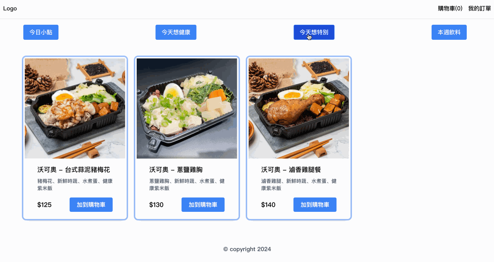

# 點餐購物車

## 目的

實作一個簡單的點餐購物車挑戰

詳細需求請見 [REQUIREMENT](./REQUIREMENT.md) 內容

## 設定

在專案目錄下，你可以使用 `npm`、`yarn` 或 `pnpm` 三種方式執行安裝，如下:

```shell
npm install
# or
yarn install
# or
pnpm install
```

## 執行

```shell
npm start
# or
yarn start
# or
pnpm start
```

啟動瀏覽器後，輸入 [http://localhost:3000](http://localhost:3000) 檢視執行畫面

## 測試

```shell
npm test
# or
yarn test
# or
pnpm test
```

## 執行畫面



## 採用技術及版號

- React.js 18.2
- Typescript 5.2
- Tailwind CSS 2.2
- Vite 5.1
- jest 29.7
- testing library 14.2

## 實作

- 採用 React.js 和 Tailwind CSS 完成前端頁面的呈現
- 資料管理的解決方案，採用 Context Provider 做為資料傳遞和保存
- 元件架構規劃，採用原子設計概念 (Atomic Design) 進行分類
- 利用 Typescript 定義型別，確保資料格式的可讀性和可靠性
- 採用 Vite 做為專案建置，程式碼打包方案，並解決開發時的開發伺服器過慢問題

## 需求

- [X] 二層選單 (類別 > 商品)
- [X] 商品加至購物車
- [X] 查看購物車
- [X] 購物車內商品數量增加/減少
- [X] 購物車內單一商品移除
- [X] 購物車結單
- [X] 訂單列表
- [X] 訂單明細
- [X] 清除所有訂單資訊
- [] 建置後端 Server
- [] 建置對應 API
  - [] 取得所有類別和對應商品 (GET)
  - [] 取得所有訂單歷史記錄 (GET)
  - [] 清除訂單歷史記錄 (DELETE)
- [] 前端重新串接對應 API
- [] 保存訂單歷史資訊至後端
